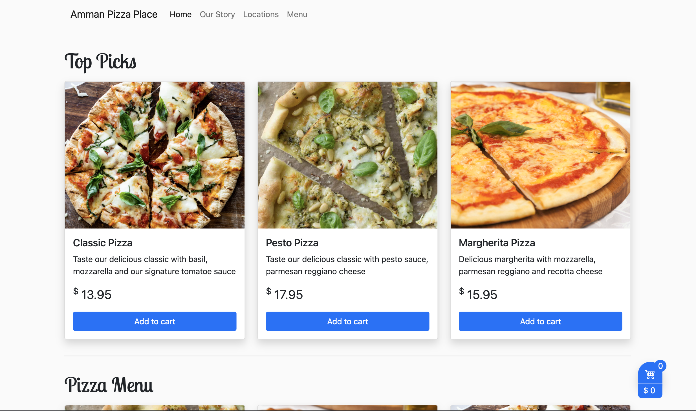
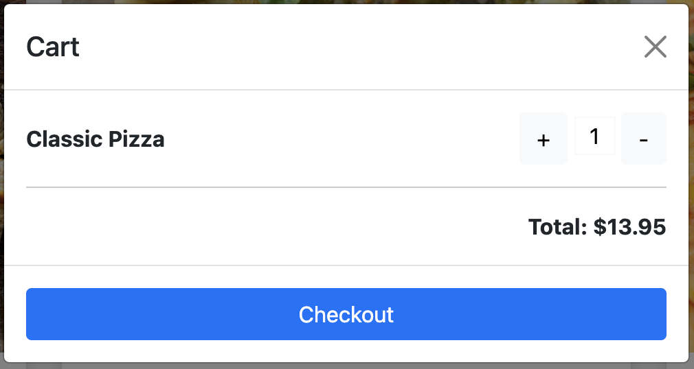

# Pizza Shop

## Description

In this challenge, we're going to add some functionality to an existing web page. Javascript is the way we interact with HTML elements, let's use it to create something cool!

### Excercise 1

Let's take a look at our app, it's a simple online ordering web page to order from a Pizza Shop

But it's missing functionality! To help make this app functional we're going to add the cart functionality. When a user clicks on the `Add to cart`, the cart should update its total items and total amount to reflect this to the user

#### **Prerequisites**

- Visual Studio Code, Git
- Fork the repo to your account
- Clone the repo to your local device
- Create a branch named _feature/cart_
- Switch to that branch

#### **Basic Requirements**

- Start by thinking of where we'll write our Javascript, whether it's `inlined` by a `<script>` tag, or imported from a `.js` file into our HTML, the choice is yours!
- After creating your `.js` file (or your `<script>` tag), make sure it's working correctly by adding an `alert("Pizza on the way!")` to the file and refreshing the page, did the alert show up?
- Let's start thinking of ways to connect the dots, assume a user clicks on `Add to cart` on the `Classic` pizza card. The cart should look something like this:

- Think of the challenge in terms of _events_. When a user **clicks** on a button, what's the event currently happening? How can we handle this event? What Javascript functionality is used to handle events?

- Now after handling the event, let's think of how we can update the cart. How can we update the cart elements? What about existing cart values? How can we avoid overriding them?

- Commit your code often, write clear commit messages!

- After completing the excercise, push the code to your remote fork

- Create a pull request from your branch `feature/cart` to the `main` branch

- Notify your mentor when done!

#### **Advanced Requirements**

Congratulations on completing your first task. Let's add some functionality to the cart to remove items from the cart

- Create a new branch from your current branch (**feature/cart**) and call it **feature/cart-modal**
- Switch to that branch
- Try clicking on the cart popup, a modal should appear
  
- These are static data, let's make them dynamic!
- Start by thinking of how to provide the modal with the customer order data.
- Where will we store the customer data? When will we store them? How can we do that?
- After successfully reflecting the added items to the modal, let's try adding add and remove functionality.
- When clicking on the `+` button, item quantity should increase and the total should reflect the new amount
- When clicking on the `-` button, item quantity should decrease and the total should reflect the new amount
- Commit your code often, write clear commit messages!

- **_Bonus_**: Can we remove the item completely if a user clicks on `-` on an item with quantity of **`1`** ?

Good luck with your task!